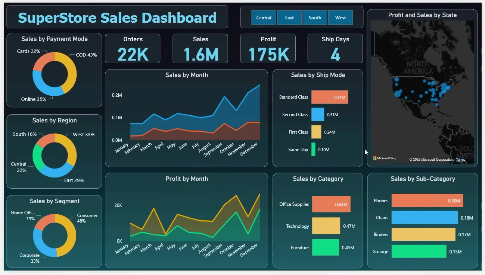

# 📊 Superstore Sales Dashboard

## 🔍 Business Problem
Businesses need to monitor sales and profit to improve performance and growth.

## 🎯 Objective
Analyze sales data to identify trends, patterns, and opportunities.

## 🛠 Tools Used
- Power BI
- Excel

## 📊 Dashboard Preview

## 📌 Key Insights
- Sales and profit trends over time
- Region-wise performance analysis
- Category and segment-wise insights

## 💡 Business Impact
Helps businesses make data-driven decisions and improve profitability.
